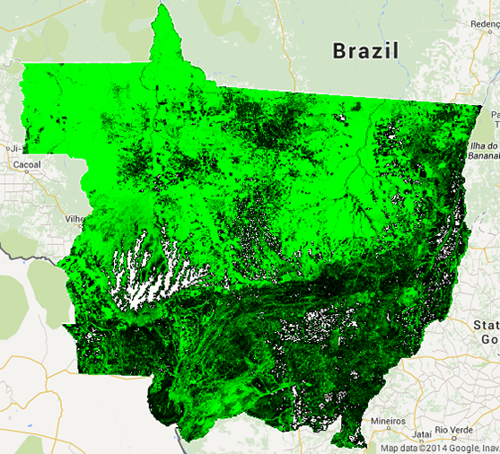
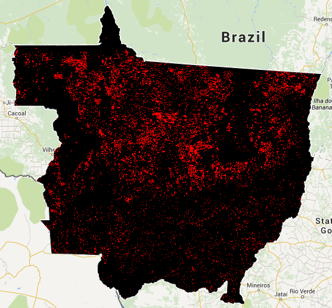
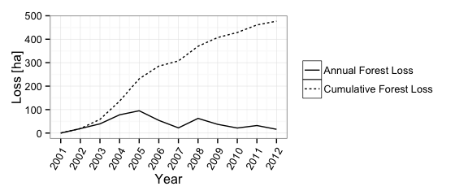
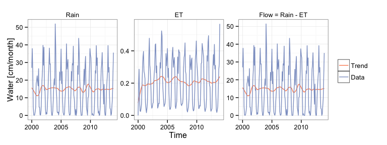
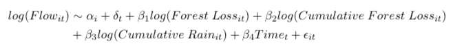
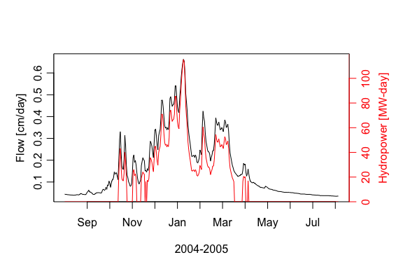

# WRI-GFW Blog
Morgan Levy  
October 7, 2014  

# The Forest-Water-Energy Nexus at the Southern Fringe of the Brazilian Amazon

Brazil's agricultural frontier is ecologically and economically crucial. Model-based studies suggest that land use change, such as agriculture-driven deforestation, can impact regional water cycles. However, there are limited data-based studies of these impacts, and even fewer that connect those changes to energy and agricultural systems.

We present preliminary results from an investigation of this land-water-energy nexus using a case study from the southern Amazon rainforest-savanna transition zone of Brazil. This region has undergone significant deforestation and agricultural development over the past several decades, and agricultural intensification and expansion of hydropower continues. Therefore, this region provides an opportunity to explore understudied land-water-energy nexus dynamics relevant to emerging economies worldwide that may grow to rely on environmentally-vulnerable, low-carbon energy. 

Our research asks: **has land use change, such as deforestation, measurably impacted regional water cycles, and could it impact water-cycle-dependent energy and agricultural production now and in the future?**

We generate a novel data set that combines forest change observations, rainfall and streamflow records, and hydropower generation estimates in river basins of Mato Grosso, Brazil. We then present results from a preliminary analysis of the relationships between land use change, flow, and hydropower.

## Land Use Change and the Hydroclimate

Large-scale land use change in the form of deforestation is observable and quantifiable in the Brazilian rainforest-savanna transition zone.

 

**Forest Cover in 2000 (left) and Forest Loss from 2001-2012 (right) in the Rainforest-Savannah Transition zone state of Mato Grosso, Brazil**

*Data Source: 30m forest cover and forest loss from [Hansen/UMD/Google/USGS/NASA, 2013](http://www.earthenginepartners.appspot.com/science-2013-global-forest/download.html) obtained using [Google Earth Engine](https://earthengine.google.org/)*

Land use change can affect the climate forcing and hydrologic response that generates patterns in temperature, evaporation, rainfall, and streamflow. The idea that we can observe impacts of land use change on the hydroclimate can be illustrated using a 'water balance', which is a formula describing the flow of water into and out of a system: 

*Rainfall = Flow + Evapotranspiration (ET)*

Rain that falls on a river basin leaves the basin in the form of river flow or evapotranspiration (ET), which is the combination of evaporation from the soil and transpiration from plants. A water balance is useful because it illustrates that plants, by way of ET, control the amount of water available to generate flow. Additionally, the transport of water to the atmosphere as ET contributes to rainfall, creating a feedback loop. Therefore, changes in vegetation cover at large enough scales may either increase or decrease flow, affecting flow-dependent ecosystems and services, such as hydropower.[^fn-WB.footnote]

## Water Data Science

The synthesis of land use, hydrologic, and hydropower data is not trivial. Therefore, a substantial part of our research effort has focused on acquiring, processing, and synthesizing data from different sources. For river flow, the temporal and spatial units of analysis are variable and irregular, and data are often poor quality. Rainfall and especially ET data are available at a limited number of sites in Brazil, although new gridded products provide improved spatial resolution. Estimating hydropower generation potential can be similarly difficult because those estimates rely on measurements of flow. Land use data, in comparison, is relatively straightforward to obtain and analyze, but is only available over limited time periods, or at very course spatial resolution.

### Case Study

We look at an example river basin located in central Mato Grosso, Brazil: a 10,887 km^2^ headwater basin of the Alto Teles Pires River, a tributary to the Amazon River. Deforestation in this basin occurred prior to 2001, however minimal deforestation continued through 2012, and transitions from pasture to cropland continue today in this region.

**Forest Loss in the Alto Teles Pires River Headwater Basin: 2001-2012**

*Data Source: [Hansen/UMD/Google/USGS/NASA, 2013](http://www.earthenginepartners.appspot.com/science-2013-global-forest/download.html) obtained using the [GFW API](http://datalab.wri.org/using-the-gfw-api-update)*

Total cumulative forest loss since 2001 was 5% of total basin area, with a maximum of 1% of the basin deforested in any year. Because we might expect deforestation to impact ET, we look at some hydrologic data over the same period of time:

**Water Balance Components in the Alto Teles Pires River Headwater Basin: 2000-2013**

*Rainfall and ET "Data" are basin- and monthly-averaged, area-normalized values; flow is calculated from rainfall and ET. "Trend" is the locally weighted polynomial regression (loess) trend component of seasonally-decomposed data. Data Source: 3-hour (aggregated to daily), 0.25x0.25 degree Tropical Rainfall Measuring Mission (TRMM) 34B2 gridded rainfall product obtained from [Google Earth Engine](https://earthengine.google.org/#detail/TRMM%2F3B42); and 8-day, 1km Moderate Resolution Imaging Spectroradiometer (MODIS) Global Evapotranspiration [MOD16](http://www.ntsg.umt.edu/project/mod16) gridded ET product.*[^fn-WB2.footnote]

Based on theory, modeling, and field-level studies, we expect to see a *decrease* in ET with increased deforestation. However, the basin shows no obvious shift in ET. The figure above made use of gridded rainfall and ET products, which provide great spatial resolution, but are only available beginning in 2000. However, historical rainfall and flow gauge (point-located) data are available for this basin going back to the mid 1970s, which is of interest because deforestation began well before 2001. We look at summary statistics for seasonal flow between 1974-1984 and 1998-2008, assuming these decades capture an approximate pre- and post-deforestation period.

**Wet Season**
<!-- html table generated in R 3.1.0 by xtable 1.7-3 package -->
<!-- Wed Oct  8 12:20:56 2014 -->
<TABLE border=1>
<TR> <TH>  </TH> <TH> Minimum </TH> <TH> 1st Quantile </TH> <TH> Median </TH> <TH> Mean </TH> <TH> 3rd Quantile </TH> <TH> Maximum </TH> <TH> Standard Deviation </TH>  </TR>
  <TR> <TD align="right"> 1974-1984 </TD> <TD align="right"> 2.97 </TD> <TD align="right"> 7.26 </TD> <TD align="right"> 10.50 </TD> <TD align="right"> 11.40 </TD> <TD align="right"> 14.70 </TD> <TD align="right"> 26.20 </TD> <TD align="right"> 5.52 </TD> </TR>
  <TR> <TD align="right"> 1998-2008 </TD> <TD align="right"> 2.87 </TD> <TD align="right"> 5.79 </TD> <TD align="right"> 10.00 </TD> <TD align="right"> 10.70 </TD> <TD align="right"> 14.00 </TD> <TD align="right"> 40.00 </TD> <TD align="right"> 6.45 </TD> </TR>
   </TABLE>

**Dry Season**
<!-- html table generated in R 3.1.0 by xtable 1.7-3 package -->
<!-- Wed Oct  8 12:20:56 2014 -->
<TABLE border=1>
<TR> <TH>  </TH> <TH> Minimum </TH> <TH> 1st Quantile </TH> <TH> Median </TH> <TH> Mean </TH> <TH> 3rd Quantile </TH> <TH> Maximum </TH> <TH> Standard Deviation </TH>  </TR>
  <TR> <TD align="right"> 1974-1984 </TD> <TD align="right"> 1.02 </TD> <TD align="right"> 1.52 </TD> <TD align="right"> 2.10 </TD> <TD align="right"> 2.30 </TD> <TD align="right"> 2.76 </TD> <TD align="right"> 5.36 </TD> <TD align="right"> 0.98 </TD> </TR>
  <TR> <TD align="right"> 1998-2008 </TD> <TD align="right"> 0.92 </TD> <TD align="right"> 1.27 </TD> <TD align="right"> 1.57 </TD> <TD align="right"> 1.90 </TD> <TD align="right"> 2.12 </TD> <TD align="right"> 5.54 </TD> <TD align="right"> 0.96 </TD> </TR>
   </TABLE>

*Statistics are computed on area-normalized, daily flow [cm/day] measured at the outlet of the basin. Data Source: [Agência Nacional de Águas (ANA)](http://www.ana.gov.br/PortalSuporte/frmSelecaoEstacao.aspx)*

Again, aside from a higher maximum and slightly more variance in wet season flow in the latter period, the summary statistics aren't very interesting. So, what do we take away from this basin-level exploration? 

Given both the short-term, remotely-sensed data and the long-term historical flow data, we see no obvious indicators of flow change. However, this merely suggests that if there is some relationship between deforestation and flow magnitudes, that relationship is not evident in the most straightforward of analyses. Detection might be limited to flow in a specific time range or within a certain magnitude (e.g. only very low or high flow). 

To get at detection and understanding of dynamics in the system as a whole, we need to look at many basins, with a variety of land use change trajectories and flow magnitudes.

## Exploratory Regression Analysis

In the land-water-energy nexus context, we are interested in several things:

1. How do flow (statistics) correspond to land use change across a range of different basins and time periods?
2. If we find an association between land use change and flow, is that association meaningful for hydropower?
3. If we do not observe a relationship between land use change and flow, why? And, do we have reason to believe we might see a relationship in the future?

In a very standard exploratory capacity, we perform a regression analysis for 72 gauged basins (a total of 5,856 monthly observations) within the state of Mato Grosso, including the Alto Teles Pires River Basin. We then connect results from the analysis to hydropower generation estimates.

We regress a set flow statistics (minimum, maximum, mean, median, extremes and deviations) on deforestation and rainfall statistics assumed to be determinants of flow according to hydrologic theory, as well as determined by [model selction criteria](http://en.wikipedia.org/wiki/Model_selection) to be statistically meaningful predictors of flow. Formally, the regression model is: 

$$ log(Flow_{it}) \sim \alpha_i + \delta_t + \beta_1 log(Forest \; Loss_{it}) + \beta_2 log(Cumulative \; Forest \; Loss_{it}) + \beta_3 log(Cumulative \; Rain_{it}) + \beta_4 Time_{it}$$

Forest loss (obtained using the [GFW API](http://datalab.wri.org/using-the-gfw-api-update)) is reported annually, however flow (source: [ANA](http://www.ana.gov.br/PortalSuporte/frmSelecaoEstacao.aspx)) and rainfall (source: [TRMM](https://earthengine.google.org/#detail/TRMM%2F3B42)) are aggregated monthly, therefore observations are monthly averaged values across all variables except forest loss, which is annual. The coefficients of interest on forest loss ($\beta_1$ and $\beta_2$) are obtained by regressing a flow statistic (e.g. mean flow) for basin $i$ and time $t$ on a time-invariant basin fixed effect ($\alpha_i$); basin-invariant fixed effect ($\delta_t$) for month; proportional and cumulative forest loss; cumulative rainfall depth; and time, which is the month and year between 2002 - 2012 (allowing for various polynomial time trends). 

### Results

The table below shows results for the model specification wherein $Flow_{it}$ is mean (monthly) flow.

<!-- html table generated in R 3.1.0 by xtable 1.7-3 package -->
<!-- Wed Oct  8 12:20:58 2014 -->
<TABLE border=1>
<TR> <TH>  </TH> <TH> Estimate </TH> <TH> Std. Error </TH> <TH> t value </TH> <TH> Pr(&gt;|t|) </TH>  </TR>
  <TR> <TD align="right"> log(loss) </TD> <TD align="right"> 0.0010 </TD> <TD align="right"> 0.0112 </TD> <TD align="right"> 0.09 </TD> <TD align="right"> 0.9313 </TD> </TR>
  <TR> <TD align="right"> log(cumloss) </TD> <TD align="right"> 0.0447 </TD> <TD align="right"> 0.0141 </TD> <TD align="right"> 3.18 </TD> <TD align="right"> 0.0015 </TD> </TR>
  <TR> <TD align="right"> log(rain.cum) </TD> <TD align="right"> 0.0435 </TD> <TD align="right"> 0.0054 </TD> <TD align="right"> 8.09 </TD> <TD align="right"> 0.0000 </TD> </TR>
  <TR> <TD align="right"> time </TD> <TD align="right"> -0.0013 </TD> <TD align="right"> 0.0004 </TD> <TD align="right"> -3.39 </TD> <TD align="right"> 0.0007 </TD> </TR>
   </TABLE>
p: 85 , N: 5856 , Adjusted R-squared: 0.77

Results are statistically significant for the effect of cumulative forest loss, however the coefficient is small. These results suggests that on average, a 25% increase in cumulative forest loss [ha] in a given year corresponds to a 1% increase in mean monthly flow; a 90% increase in cumulative forest loss corresponds to a 4% increase in flow.[^fn-lm.footnote]  To put that in terms of flow rates: a 1% increase in mean monthly flow in the wet season in the Alto Teles Pires basin is equivalent to an increase in the flow rate by 4.6 m^3^/second; a 4% increase is equivalent to an increase of 18.2 m^3^/second.

Coefficients for regressions on median flow and extremes are similar (ranging between 0.03 and 0.06), with p-values < 0.05 for cumulative loss, rainfall, and time in all regressions. The regression on flow deviations (root mean squared deviation from a basin monthly mean) had a slightly higher coefficient (0.10, p-value < 0.05), indicating that forest loss is more strongly associated with flow deviations than the other flow statistics.

## Hydropower

What does the estimated relationship between deforestation and flow mean for hydropower? 

'Small' (or run-of-river) hydropower plants, which require a small reservoir or no reservoir, are increasingly popular because they minimize environmental impacts, can exploit more sites, generate power in low-head (small elevation change) rivers, cost significantly less, and can be built and used by rural communities.  However, small hydropower facilities are more sensitive to variability in flow due to their design.

In our study, we use a simple algorithm to estimate energy-maximizing flow capacity (the maximum flow handled by the plant) and efficiency parameters for hypothetical small hydropower plants at locations where flow is measured.[^fn-hydro.footnote] For small hydropower, generation efficiencies vary within a range of flow, and generation ceases below a flow threshold that is determined by the turbine type and plant flow capacity.

If deforestation were to impact rivers in the way previous studies suggest, flow might occur more or less frequently within the flow range for which plants are designed, resulting in sub-optimal generation. There have been multiple calls for research on land use change impacts to river flow for precisely this reason. Modeling studies suggest deforestation may impact large reservoir facilities in Brazil, however, empirical analyses are limited, as are those that focus on small hydropower.

Again, using the example of the Alto Teles Pires, we estimate hydropower generation potential at a hypothetical single-turbine run-of-river plant located within a head-maximizing 2-km radius of the existing flow gauge.

**Flow and Modeled Hydropower at the Outlet of the Alto Teles Pires River Basin**

*Flow is basin area-normalized daily flow measured at the basin outlet; Energy is energy generation potential in MW-days based on site-specific, energy-optimizing plant parameters (a single Francis turbine, an optimal plant capacity of 1.5 cm/day, non-zero efficiencies ranging from 0.46 to 0.86, and no minimum environmental flow). Data Source: [Agência Nacional de Águas (ANA)](http://www.ana.gov.br/PortalSuporte/frmSelecaoEstacao.aspx)*

We apply the percentage increases in flow estimated by the regression to the Alto Teles Pires case: in the wet season, a 1% (or 4%) increase in mean wet season flow is equivalent to 2.4% (9.6%) of the minimum power-generating flow rate, and 0.2% (0.9%) of the maximum power-generating flow rate. In the dry season, both 1% or 4% increases in mean flow represent an insignificant fraction of power-generating flow extremes.

The results suggest that in this basin, even extreme deforestation (e.g. the 90% increase in cumulative loss) would have negligible impact on peak energy generation, but possibly small (positive) impact on low flow energy generation. As with flow, it will be important to look at hydropower estimates across more than one basin - and we plan to in future work!

# Next Steps

Ongoing work includes exploration of hydroclimate variables over an extended four-state region, which includes between 150-200 additional flow gauges; refinement of hydropower modeling methods; inclusion of other land use type categorizations, such as pasture and cropland; and additional regression (and other statistical) analyses of the relationship between land use change and flow, hydropower, and ultimately - temperature, humidity, and rainfall characteristics meaningful to food and biofuel agriculture.

Where data availability reaches it's limit - particularity in the case of flow measurements, we plan to employ limited modeling techniques. For example, many basins, especially small ones, are not gauged in Brazil but may have more dramatic response to land use change. Therefore, using simple, data-validated flow prediction models, we can carry out an analysis similar to the one presented here, but on a much larger and more diverse set of basins.

****

[Morgan Levy](http://erg.berkeley.edu/people/levy-morgan/) (mclevy@berkeley.edu) is a PhD student in the Energy and Resources Group at the University of California, Berkeley. 

This research is advised and co-authored by [Sally Thompson](http://www.ce.berkeley.edu/people/faculty/thompson) (Civil and Environmental Engineering, UC Berkeley) and [Avery Cohn](http://fletcher.tufts.edu/CIERP/People/bios/cohn) (Fletcher School, Tufts University), and was assisted by Thompson Ecoyhdrology Lab undergraduate researcher [Herman Wu](http://vcresearch.berkeley.edu/energy/cal-energy-corps-summer-2014-participants-work-Herman-Wu). 

This work was made possible through the support of the [GFW Graduate Student Research Program](http://datalab.wri.org/gfwsrp), with special thanks to Dan Hammer, as well as support from the [UC Berkeley Philomathia Center](http://vcresearch.berkeley.edu/philomathiacenter/about) and [Energy Biosciences Institute](http://www.energybiosciencesinstitute.org/), NSF-GRFP, and the [UC Berkeley Cal Energy Corps Program](http://vcresearch.berkeley.edu/energy/welcome-cal-energy-corps).

[^fn-WB.footnote]: For a summary of this process, see the Woods Hole Research Center's [discussion of deforestation and water feedbacks](http://www.whrc.org/ecosystem/amazon_water.html). There are other ways that vegetation change can impact flow, but at large scales, the mechanism is primarily ET. This simple water balance model ignores a great deal of complexity, but the formula is valid over sufficiently long period of time (so that short term water storage in soils can be neglected), where diversions or reservoirs do not significantly impact river flow, and where drainage to a groundwater aquifer is negligible.

[^fn-WB2.footnote]: Ideally, a water balance that ignores change in storage, as presented here, would be calculated over a full year. We show monthly water-balance flow purely for illustration. The mean residence time of water in this basin was estimated to be between 15 days.

[^fn-ET.footnote]: Validation (comparison with ground-measured ET records) for this product included a single site in tropical Brazil.

[^fn-hydro.footnote]: These sites are not necessarily locations where hydropower development is slated, but obtaining information on hydropower generation at river flow locations across the study region provides an approximation to energy generation capacities in the region, and the only way to empirically connect land use change, flow, and hydropower generation estimates.

[^fn-LUCC.footnote]: For example, from [additional land use data](http://iopscience.iop.org/1748-9326/9/6/064010), we know approximately 80% of the basin was pasture throughout the 2001-2012 period.

[^fn-lm.footnote]: According to the log-log model, percentage changes are calculated from coefficients as: % chang in flow = $\beta_1$ * % change in forest loss
